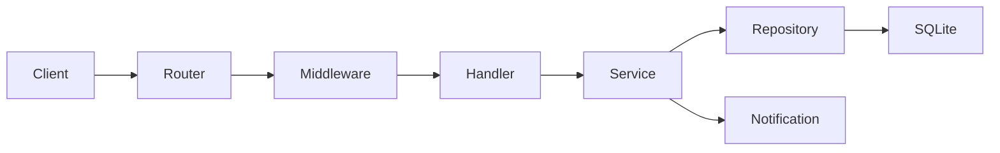

# Архитектура backend

## Назначение

REST API личного кабинета клиентов: авторизация, профиль, заявки, уведомления. Поддерживаются роли `client`, `manager`, `admin`.

## Слои

```text
cmd/api/main.go          — точка входа, роутинг, graceful shutdown
internal/handler         — HTTP-контроллеры, JSON
internal/service         — бизнес-логика, права доступа
internal/repository      — SQLite, SQL-запросы
internal/model           — доменные сущности
internal/auth            — JWT, bcrypt
internal/notification    — email/SMS/in-app
internal/middleware      — аутентификация, роли
internal/config          — env-конфигурация
```

## Поток запроса



## Модель данных

| Таблица | Назначение |
|---------|------------|
| `users` | Учётные записи и роли |
| `profiles` | Профиль пользователя (1:1 с `users`) |
| `applications` | Заявки клиентов |
| `notifications` | In-app, email, SMS события |

## Роли и доступ

| Роль | Возможности |
|------|-------------|
| `client` | Свой профиль, свои заявки, свои уведомления |
| `manager` | Назначенные заявки, смена статуса, список пользователей |
| `admin` | Полный доступ ко всем сущностям |

## Статусы заявок

`draft` → `submitted` → `in_review` → `approved` / `rejected`

- Клиент: `draft` → `submitted`
- Менеджер: `submitted` → `in_review` / `rejected`, `in_review` → `approved` / `rejected`
- Админ: любые валидные переходы

## Уведомления

События:

- создание заявки — in-app + email клиенту, in-app + email менеджерам;
- смена статуса — in-app + email + SMS клиенту.

В dev-режиме email/SMS пишутся в лог (`SMS_PROVIDER=log`, SMTP localhost).

## Безопасность

- Пароли: bcrypt
- API: JWT Bearer
- SQLite: `foreign_keys = ON`
- Валидация ролей и переходов статусов на уровне service
